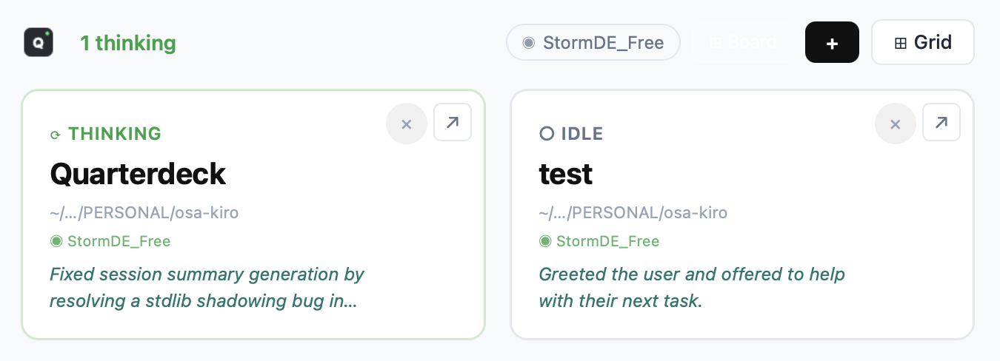
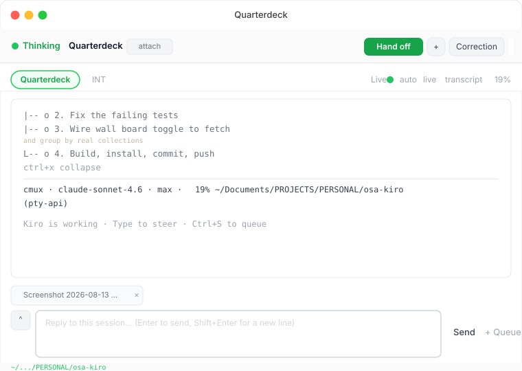
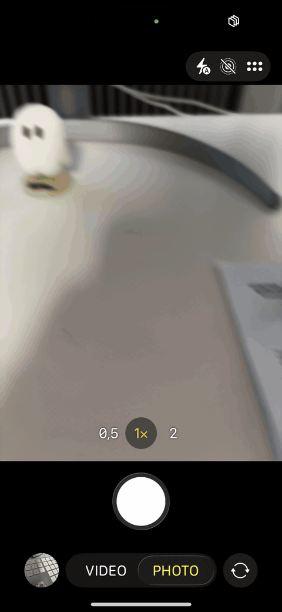

<h1 align="center">
  <a href="https://github.com/vidanov/quarterdeck">
    
  </a>
</h1>

<div align="center">


**A control surface for Kiro CLI agents. Session status at a glance, approval gates that actually hold, and the ability to answer from your phone.**

[Quick start](#quick-start) &middot; [How it works](#how-it-works) &middot; [Phone access](#phone-access-over-tailscale) &middot; [Hooks](#hooks-and-approval-gating) &middot; [Security](#security)

</div>

<br/>

<p align="center">
  
</p>

<br/>

## Why this exists

Every time a Kiro CLI agent reaches a decision point, it either proceeds silently or blocks in the terminal — neither of which is useful when you have a dozen sessions running across several projects and you stepped away from the keyboard.

Quarterdeck solves three concrete problems:

- **You don't know what needs you.** Sessions that hit an approval prompt, produced an error, or stalled disappear into the background. Quarterdeck surfaces them.
- **You can't answer from your phone.** Agents block in a tmux pane. Reviewing and approving a tool call required sitting at the Mac. With Tailscale, the full UI is reachable from any device on your tailnet.
- **You can't enforce constraints without the agent talking past them.** A `preToolUse` hook can hold a tool call entirely until you allow or deny it. The agent cannot proceed while the gate is open. A rules file can.

What you get:

- **Real-time session grid** — color-coded cards for every active and recent session, updating within 2 seconds
- **Structural approval gates** — hold `preToolUse` calls until you approve or deny them from the app or a phone
- **Transcript and pane views** — send replies, review conversation history, or watch the raw terminal pane
- **Wall view with board mode** — all sessions on one full-screen surface, optionally grouped by project
- **Phone-ready layout** — approval controls, session cards, and input composer built for a small screen
- **Audit trail** — every mutating request, approval decision, and tool outcome recorded to a bounded local log
- **Concierge** — natural-language command bar for finding sessions, launching work, and generating reports
- **Draft persistence and history** — input drafts survive session switches; arrow-up recalls sent messages
- **Context compaction** — one click to send `/compact` when context is running high
- **Self-update** — `Settings > Updates` pulls, rebuilds frontend, and restarts the backend in place

## Quick start

> **Requires:** macOS 13+, Python 3.14, Node.js, [Kiro CLI](https://kiro.dev/docs/cli/quick-start/), [tmux](https://github.com/tmux/tmux)
>
> **For phone and remote access:** [Tailscale](https://tailscale.com/download) installed and running on both the Mac and the mobile device. The remote serving feature binds to the Mac's Tailscale IP — it does not work over regular LAN or the public internet.

```bash
git clone <repository-url>
cd quarterdeck

python3 -m venv venv
source venv/bin/activate
pip install -r requirements.txt

cd frontend && npm install && npm run build && cd ..

python3 app.py
```

The native window opens and connects to the API at `http://127.0.0.1:19418`.

For frontend hot reload during development:

```bash
./start.sh
# Backend: http://127.0.0.1:19419  Frontend: http://localhost:5173
```

To build a native `.app` bundle:

```bash
./build-app.sh
./build-app.sh --install   # also replaces /Applications/Quarterdeck.app
```

## How it works

Quarterdeck reads `~/.kiro/sessions/cli/` — the directory where Kiro CLI stores session state. It never writes to those files.

```
~/.kiro/sessions/cli/
  {uuid}.lock    active session (pid, started_at)
  {uuid}.json    metadata (title, cwd, timestamps)
  {uuid}.jsonl   conversation log (prompts, responses, tool calls)
```

Status is derived from the JSONL tail: the last tool call means running; a prompt pattern means awaiting approval; no lock file means idle or done. Four optional hooks sharpen this with real signals from kiro-cli:

| Hook | What it does |
|------|-------------|
| `agentSpawn` | Identifies the session when kiro-cli starts |
| `stop` | Exact end-of-turn signal (no more JSONL polling guesses) |
| `preToolUse` | Holds tool calls until you allow or deny them |
| `postToolUse` | Records tool outcomes in the audit trail |

Hooks are installed from **Settings > Kiro hooks** and merged into each agent configuration without overwriting existing hooks. Built-in Kiro agents cannot carry file-backed hooks; the UI reports that limitation rather than implying they are protected.

Sessions run in detached tmux sessions and survive Quarterdeck restarts.

## Phone access over Tailscale

Setup takes about a minute:

1. Go to **Settings > Remote access** and start remote serving.
2. Reveal the QR code and scan it from the phone.
3. Optionally install the LaunchAgent so remote serving restarts after login.

<p align="center">
  
</p>

The QR code carries a random, single-use exchange code that expires after two minutes. The long-lived token is not in the URL. Redeeming the code sets an HttpOnly, `SameSite=strict` cookie for 30 days.

Remote serving binds only to the Mac's Tailscale IPv4 address and rejects connections from outside the tailnet. The wire is already encrypted inside WireGuard, so there is no separate TLS layer.

**Do not put `tailscale serve` in front of it.** `tailscaled` would proxy from `127.0.0.1`, which this API treats as a trusted local caller — removing the token check entirely for anyone on your tailnet, and Funnel would extend that to the public internet.

`./remote.sh` is still available as a manual command-line alternative.

## Hooks and approval gating

Gating is off by default and enabled per session from the detail panel. When gating is on:

1. The agent reaches a `preToolUse` hook.
2. Quarterdeck holds the call and shows it in the approval queue.
3. You allow or deny from the app or the phone.
4. The hook exits 0 (allow) or non-zero (deny) and the agent continues.

The agent cannot talk past this gate. It is an exit code, not a suggestion.

Approval gating requires a file-backed agent configuration. Sessions started from the built-in kiro-cli agents show a warning instead.

## Security

Quarterdeck can start processes and type into a shell-capable agent. Anyone past its access token can run code as your macOS user.

Current controls:

- Remote mode binds only to the Tailscale IPv4 address
- Connections from outside the tailnet's assigned ranges are rejected at the socket level
- Mutating session input and dispatch are rate-limited to 10 requests/minute
- A long-lived shared token (HttpOnly cookie) protects remote access
- An optional audit trail records requests, approval decisions, and tool outcomes
- The local API at `127.0.0.1` is trusted without a token, consistent with local process access

What is not there: per-device revocation, application-level TLS outside WireGuard, and per-user accounts. Do not run Quarterdeck on a shared machine without understanding that.

## Project structure

```
app.py                  macOS app entry point (pywebview + backend thread)
backend/
  api.py                FastAPI: 138 routes covering sessions, dispatch, hooks,
                        approvals, audit, remote, collections, stats, cleanup
  config.py             Paths and constants (~/.osa-kiro/)
frontend/
  src/
    App.jsx             Session grid, wall view, board mode, concierge
    components/
      DetailPanel.jsx   Transcript, pane view, approval controls, input composer
      SessionGrid.jsx   Card layout, attention partitioning
      SettingsPanel.jsx Remote access, hooks, updates, cleanup
docs/
  ROADMAP.md            Forward-looking work
  CHANGELOG.md          Completed items with root-cause notes
  HANDOVER-pty-api.md   Verified behavior and known constraints
  ARCHITECTURE-pty-api.md  Design rationale
```

Local state lives in `~/.osa-kiro/`:

```
managed.json    Quarterdeck-owned tmux sessions
settings.json   Shared preferences
stacks/         Per-session queued work
gates/          Held preToolUse state
approvals/      Approval decisions
audit/          Date-partitioned JSONL records
```

## When not to use this

Quarterdeck is purpose-built for Kiro CLI on macOS. It will not work with other coding agents, on Linux or Windows, or if you do not use tmux. If you want a general-purpose agent UI or a cloud-hosted control plane, this is not that.

## Contributing

The most useful contributions right now:

- **Linux port** — the pywebview layer is the main obstacle; GTK backend exists but the approval gating and hook installer need testing
- **Non-Kiro agent support** — the JSONL format and hook interface are documented; adapters for other agents would be welcome

Bug reports with reproduction steps are useful. Feature requests should explain the problem first, not the solution — the design decisions in `docs/SPEC.md` explain why some obvious features are missing.

## Tests

```bash
source venv/bin/activate
python -m pytest tests/ -q
npm --prefix frontend run build
```

GitHub Actions runs both on macOS for every push and pull request.

## License

[MIT](LICENSE)

---

<sub>
  State persists under <code>~/.osa-kiro/</code>. Bundle identifier: <code>com.vidanov.quarterdeck</code>.
  Internal identifiers (<code>DECK_*</code> env vars, <code>com.osa-kiro.remote</code> LaunchAgent, <code>deck-*</code> hook markers) are stable across the product rename from Deck.
</sub>
